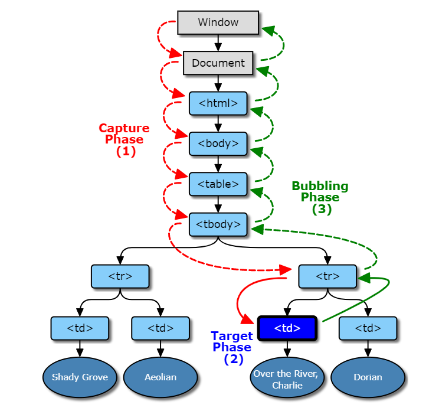

# Eventos en JavaScript
  ***Ezequiel Cantu de la Rosa | 19100155***
## ¿Qué son?
En JavaScript, la interacción con el usuario se consigue mediante la captura de los eventos que éste produce. Un evento es una acción del usuario ante la cual puede realizarse algún proceso (por ejemplo, el cambio del valor de un formulario, o la pulsación de un enlace).
Los eventos se capturan mediante los manejadores de eventos. El proceso a realizar se programa mediante funciones JavaScript llamadas por los manejadores de eventos.
### ¿Como capturar uno?
Al burbujear el evento del elemento más interno se maneja primero y luego el externo: el evento de clic del elemento < p > se maneja primero, luego el evento de clic del elemento < div >. <br>
Dicho de otro modo, en un ejemplo:

``` 
        document.getElementById("child").addEventListener("click", function () {  
           alert("You clicked the Child element!");
        }, false);
 
        document.getElementById("parent").addEventListener("click", function () {
            alert("You clicked the parent element!");
        }, false);
```

En donde, al presionar uno de los dos elementos se llevan a cabo secuencialmente, desde el proceso interno hasta el externo.

## Fases del flujo de eventos
Las tres fases de flujo de eventos se ilustran en el siguiente diagrama:

